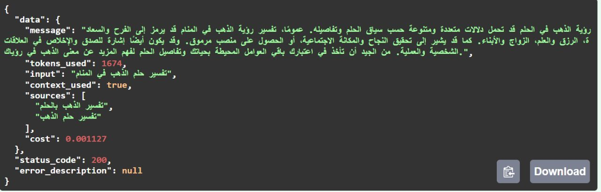
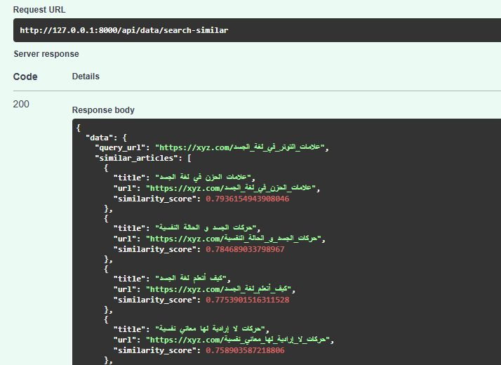
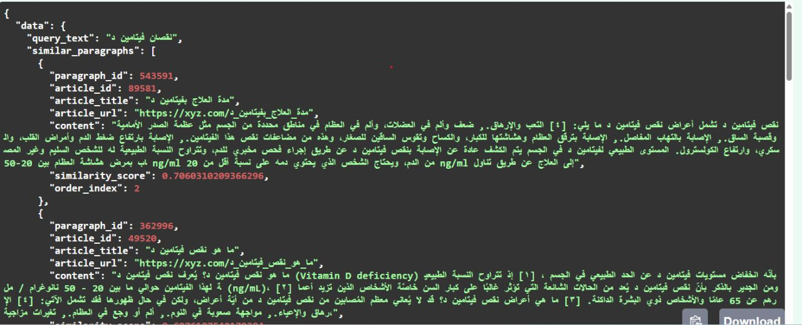
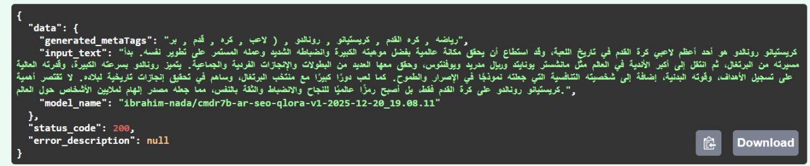
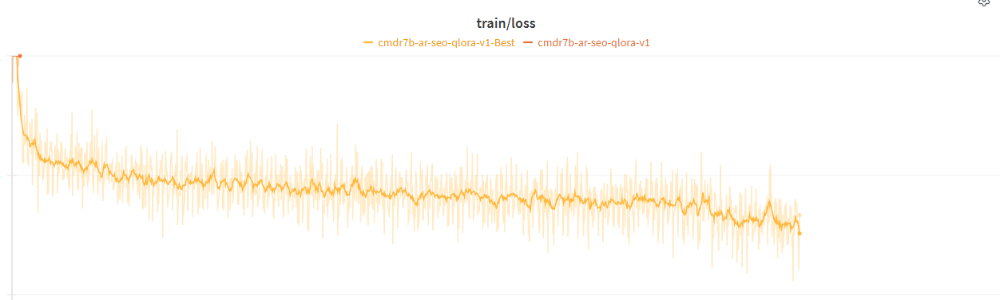

# nlp-RAG-semantic-approximator-finetuned-model

**An end-to-end Arabic RAG platform** — from raw web pages to grounded LLM answers — built as a production-style async FastAPI system. It covers the full retrieval-augmented generation lifecycle: scraping and cleaning Arabic articles, generating vector embeddings, HNSW-indexed semantic search over pgvector, a provider-agnostic RAG pipeline with source attribution and cost tracking, and a custom **QLoRA fine-tuned Command-R7B Arabic model** ([`ibrahim-nada/cmdr7b-ar-seo-qlora-v1`](https://huggingface.co/ibrahim-nada/cmdr7b-ar-seo-qlora-v1-2025-12-20_19.08.11)) served in-process for SEO generation.

> Skip to the [**Showcase**](#showcase--real-inference-results) to see real inference results, or [Fine-Tuning](#fine-tuning-qlora-on-command-r7b-arabic) for training details.

## What It Does

```
Article URL ──► Scrape ──► Embed (Ollama) ──► Store in pgvector ──► Semantic Search
                                                       │
                                           ┌───────────┴───────────┐
                                           ▼                       ▼
                                    RAG Pipeline             SEO Generation
                                (ChatGPT/DeepSeek/      (QLoRA fine-tuned
                                 Ollama/Claude)          Command-R7B Arabic)
```

### Features

- **RAG Pipeline** — Context retrieval → LLM call → grounded answers with sources and cost tracking, provider-agnostic (ChatGPT / Claude / DeepSeek / Ollama)
- **Semantic Search** — HNSW-indexed cosine similarity on 1024-dim vectors (pgvector), at both article and paragraph granularity
- **SEO Generation** — Arabic meta description generation via QLoRA fine-tuned `c4ai-command-r7b-arabic` (4-bit quantized), trained in this repo
- **Article Scraping** — Async HTML extraction with content, metadata, and SEO data (httpx + BeautifulSoup4)
- **Arabic NLP** — Diacritic stripping, Alef/Teh Marbuta normalization, hidden Unicode removal, stopword filtering
- **Queue Processing** — Optional RabbitMQ consumer for async embedding generation (aio-pika)
- **Caching** — Optional Redis caching for similarity search results
- **Security** — Optional API key auth (`X-API-Key` header), CORS, rate limiting (slowapi)

### Architecture

- Modular feature-based layout — each module owns its routes, services, DTOs, entities, and DI wiring
- FastAPI dependency injection with `Annotated` type aliases
- Interface abstractions (`ILLMProvider`, `IWebScraper`) with factory-based resolution
- Fully async I/O: database (asyncpg), HTTP (httpx), embeddings (Ollama `AsyncClient`), queue (aio-pika)
- Repository pattern for data access, service layer for orchestration
- In-process event bus for inter-module communication (no HTTP self-calls)
- Structured logging with correlation IDs and optional Seq integration
- Generic `ResponseDto[T]` with `.success()` / `.fail()` factory methods

## Showcase — Real Inference Results

All screenshots below are real responses from the running system against a corpus of scraped Arabic articles.

### RAG — Grounded Q&A with Sources & Cost Tracking

A question in Arabic (*"تفسير حلم الذهب في المنام"* — interpretation of gold in a dream) is answered using retrieved paragraph context. Note the `context_used` flag, the `sources` that grounded the answer, token usage, and the computed API `cost`:



### Semantic Search — Article Level

Given an article URL about *signs of stress in body language*, the system returns semantically related articles (grief in body language, body movements and psychological state, learning body language) ranked by cosine similarity — pure vector semantics, no keyword matching:



### Semantic Search — Paragraph Level

A short free-text query (*"نقصان فيتامين د"* — vitamin D deficiency) retrieves the most relevant individual paragraphs across the entire corpus, each with its similarity score and source article:



### SEO Generation — Fine-Tuned Model Inference

The QLoRA fine-tuned Command-R7B Arabic model generates SEO meta tags for an Arabic article (about Cristiano Ronaldo) — served directly by the API with 4-bit quantization:



## Fine-Tuning (QLoRA on Command-R7B Arabic)

The SEO generation module runs a custom fine-tune trained in this repo — full training code in [cmdr7b_arabic_seo_lora.ipynb](src/modules/model_traning/cmdr7b_arabic_seo_lora.ipynb):

| | |
|--|--|
| Base model | [`CohereLabs/c4ai-command-r7b-arabic-02-2025`](https://huggingface.co/CohereLabs/c4ai-command-r7b-arabic-02-2025) |
| Method | QLoRA — PEFT adapters on a 4-bit NF4 double-quantized base (TRL `SFTTrainer`) |
| Task | Arabic article → SEO meta description / meta tags |
| Training data | [`ibrahim-nada/mawdoo3-seo-preprocessed-cleaned`](https://huggingface.co/datasets/ibrahim-nada/mawdoo3-seo-preprocessed-cleaned) — prompt/completion pairs prepared from the scraped article corpus, filtered to ≤ 450 words and > 10 tokens |
| Published adapter | [`ibrahim-nada/cmdr7b-ar-seo-qlora-v1-2025-12-20_19.08.11`](https://huggingface.co/ibrahim-nada/cmdr7b-ar-seo-qlora-v1-2025-12-20_19.08.11) |
| Tracking | Weights & Biases (loss curve below), checkpoints pushed to HF Hub every 100 steps |
| Serving | Lazy-loaded in-process, `BitsAndBytesConfig` 4-bit NF4 + fp16 compute, CPU offload fallback |

**Hyperparameters:**

| LoRA | Training |
|------|----------|
| `r=16`, `alpha=32`, `dropout=0.1` | 3 epochs, batch size 8, max seq len 1024 |
| Target modules: all attention (`q/k/v/o_proj`) + MLP (`gate/up/down_proj`) | LR `1e-4`, cosine schedule, warmup ratio 0.01 |
| 4-bit NF4 double quant, bf16 compute (Ampere+) | `paged_adamw_32bit`, weight decay 0.001, max grad norm 0.3 |

**Prompt template** (structured markers for instruction, article, and output):

```
<SEO_PROMPT_PREFIX>
اكتب وصف ميتا للمقال التالي

<ARTICLE_TEXT>
{article}

<SEO_OUTPUT_PREFIX>
{meta_description}
```

Training loss over the fine-tuning run:



## Tech Stack

| Layer | Technology |
|-------|-----------|
| API | FastAPI 0.116.1, Uvicorn |
| Database | PostgreSQL + pgvector (async via asyncpg) |
| ORM | SQLAlchemy 2.0.43 (async) |
| Migrations | Alembic 1.16.5 |
| Embeddings | Ollama (`nomic-embed-text`, 1024-dim) |
| Scraping | httpx (async) + BeautifulSoup4 |
| LLM Providers | OpenAI SDK (ChatGPT, DeepSeek), Ollama, Claude |
| Queue | RabbitMQ via aio-pika (optional) |
| Cache | Redis (optional) |
| Logging | seqlog → Seq (optional) |
| Arabic NLP | Inline diacritics/normalization (no runtime camel-tools dependency) |
| Fine-tuning | Transformers, PEFT (QLoRA), bitsandbytes (4-bit), PyTorch |
| Rate Limiting | slowapi |

## Getting Started

### Prerequisites

- Python 3.12+
- PostgreSQL with [pgvector](https://github.com/pgvector/pgvector) extension
- Ollama with `nomic-embed-text` model

Optional:
- RabbitMQ (for async embedding generation)
- Redis (for caching similarity results)
- Seq (for structured log aggregation)

### Installation

```bash
git clone https://github.com/IbrahimMNada/nlp-semantic-lab.git
cd nlp-semantic-lab

python -m venv .venv
source .venv/bin/activate  # Linux/Mac
# .venv\Scripts\activate   # Windows

pip install -r requirements.txt

cp .env.example .env
# Edit .env — at minimum set DATABASE_URL

alembic upgrade head
```

### Ollama Setup

```bash
# Install Ollama: https://ollama.ai
ollama pull nomic-embed-text

# Optional: local LLM for RAG (if using Ollama as LLM_PROVIDER)
ollama pull llama3.2
```

### Infrastructure (Docker)

```bash
cd docker && docker compose up -d
```

Starts: RabbitMQ (5673, management on 15673), Redis (6380), RedisInsight (8082), Seq (5343), PostgreSQL (5433), Ollama (11435).

### Running

```bash
uvicorn src.main:app --reload
```

| | URL |
|--|-----|
| API | http://localhost:8000 |
| Swagger UI | http://localhost:8000/docs |
| ReDoc | http://localhost:8000/redoc |

#### Async Embeddings (Optional)

Set `QUEUE_ENABLED=true` in `.env`, then in a separate terminal:

```bash
python -m src.modules.data.consumers.embeddings_consumer
```

## Configuration

All settings via environment variables (`.env`). See `.env.example` for the full list.

| Variable | Purpose | Default |
|----------|---------|---------|
| `DATABASE_URL` | PostgreSQL connection string | *(required)* |
| `OLLAMA_URL` | Ollama server for embeddings | `http://localhost:11435` |
| `OLLAMA_MODEL_NAME` | Embedding model name | `nomic-embed-text` |
| `LLM_PROVIDER` | RAG LLM backend: `chatgpt`, `claude`, `deepseek`, `ollama` | `chatgpt` |
| `OPENAI_API_KEY` | OpenAI key (for ChatGPT provider) | |
| `DEEPSEEK_API_KEY` | DeepSeek key | |
| `QUEUE_ENABLED` | Enable RabbitMQ async embeddings | `false` |
| `REDIS_URL` | Redis connection URL | `redis://localhost:6380/0` |
| `API_KEY_ENABLED` | Require `X-API-Key` header | `false` |
| `API_KEY` | Expected API key value | |
| `CORS_ALLOWED_ORIGINS` | Allowed CORS origins | `["*"]` |
| `SEQ_ENABLED` | Enable Seq structured logging | `false` |
| `HF_TOKEN` | HuggingFace token (for SEO model download) | |

## API Endpoints

### Health

| Method | Path | Description |
|--------|------|-------------|
| `GET` | `/ping` | Returns app name |

### Data Module — `/api/data`

| Method | Path | Rate Limit | Description |
|--------|------|-----------|-------------|
| `POST` | `/process` | 10/min | Scrape URL → save article → generate embeddings |
| `POST` | `/search-similar` | 30/min | Find similar articles by URL (article-level vectors) |
| `POST` | `/search-similar-paragraphs` | 30/min | Find similar paragraphs by text (paragraph-level vectors) |
| `POST` | `/rebuild-index` | 2/min | Recreate HNSW vector indexes |
| `POST` | `/compute-article-embeddings` | — | Precompute article vectors from paragraph averages |
| `POST` | `/process-articles-without-embeddings` | — | Backfill embeddings for existing articles |
| `GET` | `/random-articles?limit=10` | — | Random articles with SEO metadata |

<details>
<summary>Example requests</summary>

```http
POST /api/data/process
Content-Type: application/json

{ "url": "https://example.com/article" }
```

```http
POST /api/data/search-similar
Content-Type: application/json

{ "url": "https://example.com/article", "limit": 10, "threshold": 0.7 }
```

```http
POST /api/data/search-similar-paragraphs
Content-Type: application/json

{ "text": "search query text", "limit": 10, "threshold": 0.5, "min_words": 10 }
```

</details>

### RAG Module — `/api/rag`

| Method | Path | Rate Limit | Description |
|--------|------|-----------|-------------|
| `POST` | `/search-context` | 30/min | Search paragraphs via the data module event bus |
| `POST` | `/ask-with-context` | 20/min | Retrieve context → build prompt → call LLM → return answer |

<details>
<summary>Example request & response</summary>

```http
POST /api/rag/ask-with-context
Content-Type: application/json

{
  "question": "What is the article about?",
  "limit": 3,
  "similarity_threshold": 0.5,
  "temperature": 0.7,
  "max_tokens": 1000
}
```

```json
{
  "data": {
    "message": "AI-generated answer grounded in your data...",
    "tokens_used": 450,
    "context_used": true,
    "sources": ["https://example.com/article1"],
    "cost": 0.0012
  },
  "status_code": 200,
  "error_description": null
}
```

</details>

### SEO Generation Module — `/api/seo`

| Method | Path | Rate Limit | Description |
|--------|------|-----------|-------------|
| `POST` | `/generate` | 10/min | Generate Arabic SEO meta description from article text |
| `GET` | `/dataset/random-samples?num_samples=10` | — | Random samples from the training dataset |

<details>
<summary>Example request & response</summary>

```http
POST /api/seo/generate
Content-Type: application/json

{ "text": "Arabic article text...", "max_length": 512, "temperature": 0.7, "top_p": 0.9 }
```

```json
{
  "data": {
    "generated_text": "Generated SEO description...",
    "input_text": "Original input...",
    "model_name": "ibrahim-nada/cmdr7b-ar-seo-qlora-v1-2025-12-20_19.08.11"
  },
  "status_code": 200,
  "error_description": null
}
```

</details>

### Authentication

When `API_KEY_ENABLED=true`, all module endpoints require the header:

```
X-API-Key: your-key
```

## Project Structure

```
src/
├── main.py                          # FastAPI app, middleware, lifespan
├── core/                            # Cross-cutting infrastructure
│   ├── config.py                    #   Pydantic Settings (env vars, lru_cache singleton)
│   ├── database.py                  #   Async/sync SQLAlchemy session factories
│   ├── security.py                  #   API key verification, rate limiter
│   ├── cache_service.py             #   Redis cache wrapper (graceful degradation)
│   ├── base.py                      #   SQLAlchemy declarative base
│   ├── base_dtos/                   #   Generic ResponseDto[T]
│   └── exceptions/                  #   BadRequestException
├── abstractions/interfaces/         # ILLMProvider, IWebScraper
├── contracts/data/                  # Shared DTOs for inter-module communication
├── shared/                          # Utilities
│   ├── arabic_text_processor.py     #   Diacritics, normalization, stopwords
│   ├── text_utils.py                #   Unicode cleanup
│   ├── event_bus.py                 #   In-process signal bus (register/send)
│   └── modules_http_client.py       #   Type-safe internal HTTP client
└── modules/
    ├── data/                        # Scraping, embeddings, vector search
    │   ├── routes.py                #   7 endpoints
    │   ├── dependencies.py          #   DI wiring (Annotated type aliases)
    │   ├── services/
    │   │   ├── data_service.py      #     Orchestration service
    │   │   ├── embedding_service.py #     Ollama embedding generation + storage
    │   │   ├── article_repository.py#     DB access (upsert, query, delete)
    │   │   ├── web_scraper.py       #     Default HTML scraper
    │   │   └── web_scraper_factory.py#    Domain-based scraper resolution
    │   ├── consumers/
    │   │   └── embeddings_consumer.py#    RabbitMQ async consumer
    │   ├── entities/                #   Article, ArticleParagraph, embedding tables
    │   └── dtos/                    #   Request/response DTOs
    ├── rag/                         # RAG pipeline
    │   ├── routes.py                #   2 endpoints
    │   ├── dependencies.py          #   LLM provider factory
    │   ├── services/
    │   │   └── rag_service.py       #     Context retrieval + LLM orchestration
    │   └── remote_models/           #   LLM provider implementations
    │       ├── chatgpt_consumer.py
    │       ├── claude_consumer.py
    │       ├── deepseek_consumer.py
    │       └── ollama_consumer.py
    ├── seo_generation/              # SEO content generation
    │   ├── routes.py                #   2 endpoints
    │   ├── dependencies.py
    │   └── services/
    │       ├── seo_service.py       #     QLoRA model loading + inference
    │       └── dataset_service.py   #     HuggingFace dataset access
    └── model_traning/               # Fine-tuning
        ├── cmdr7b_arabic_seo_lora.ipynb  # Full QLoRA training run (Colab GPU)
        ├── fine-tuner.py            #   Training imports/entry point
        ├── data_set_services.py     #   Dataset preparation
        └── notebooks/               #   Training datasets
```

## Database Schema

PostgreSQL with pgvector extension — four tables:

| Table | Purpose |
|-------|---------|
| `articles` | Scraped content with flattened SEO metadata (meta tags, Open Graph, Twitter Cards as JSON) |
| `article_paragraphs` | Individual paragraphs with `order_index`, FK → `articles` |
| `paragraph_embeddings_1024` | 1024-dim vector per paragraph, HNSW indexed (`m=16`, `ef_construction=64`, cosine) |
| `article_embedding_1024` | 1024-dim vector per article (mean of paragraph vectors), HNSW indexed |

## Data Flow

**Scrape → Embed → Search:**
```
POST /api/data/process { url }
  → WebScraperFactory resolves scraper by domain
  → Scrape HTML → extract title, author, paragraphs, SEO metadata
  → ArticleRepository: upsert article + save paragraphs
  → EmbeddingService: generate 1024-dim vector per paragraph via Ollama
  → Compute article embedding (mean of paragraph vectors)
  → Store vectors in pgvector with HNSW index
```

**RAG:**
```
POST /api/rag/ask-with-context { question }
  → Event bus → Data module: search similar paragraphs (cosine similarity)
  → Build prompt with retrieved context
  → Call configured LLM provider (ChatGPT / DeepSeek / Ollama / Claude)
  → Return answer with sources and cost
```

**SEO Generation:**
```
POST /api/seo/generate { text }
  → Load QLoRA adapter on 4-bit quantized Command-R7B base (lazy init)
  → Preprocess Arabic text (normalize, strip diacritics)
  → Tokenize, truncate to 1020 tokens, generate (max 25 new tokens)
  → Return cleaned meta description
```

## Design Patterns

| Pattern | Implementation |
|---------|---------------|
| Dependency Injection | `Annotated` + `Depends` type aliases per module (`DataServiceDep`, `RagServiceDep`) |
| Repository | `ArticleRepository` — all SQL/ORM access isolated |
| Service Layer | `DataService`, `RagService`, `SeoService` — orchestration logic |
| Factory | `WebScraperFactory` (domain → scraper), `get_llm_provider()` (config → LLM) |
| Interface Abstraction | `ILLMProvider`, `IWebScraper` — pluggable implementations |
| Singleton | `@lru_cache()` on service factories |
| Event Bus | `event_bus.register()` / `event_bus.send()` — decoupled inter-module calls |
| Generic DTO | `ResponseDto[T]` with `.success()` / `.fail()` |

## Development

```bash
alembic upgrade head                              # Run migrations
alembic revision --autogenerate -m "description"  # Create migration
uvicorn src.main:app --reload                     # Start with hot reload
```

### Monitoring Services

| Service | URL |
|---------|-----|
| Swagger UI | http://localhost:8000/docs |
| ReDoc | http://localhost:8000/redoc |
| RabbitMQ Management | http://localhost:15673 |
| RedisInsight | http://localhost:8082 |
| Seq | http://localhost:5343 |

## License

MIT — see [LICENSE](LICENSE).

